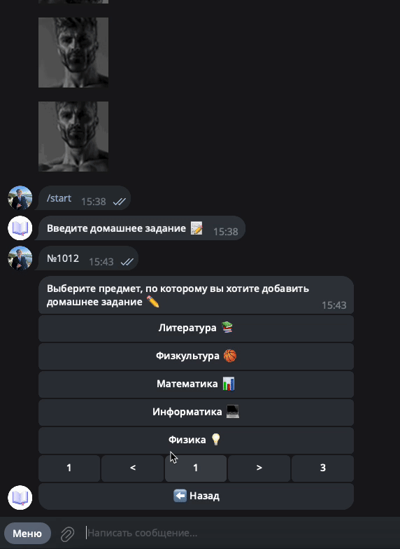
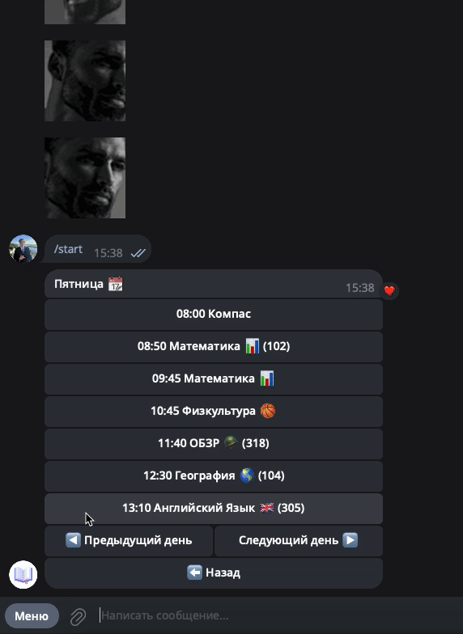

# 📚 StudyHelper - Бот для Расписания и Домашнего Задания

**StudyHelper** - Telegram-бот помощник, который упрощает ведение школьного дневника, автоматизацией сбора домашнего задания, а также упорядоченным выводом расписания. Здесь легко контролировать выполнение, пропуск Д/З. Расписание автоматически парсится с сайта mstimetables.


## Возможности

- **Автоматический парсинг расписания mstimetables:** Бот сам достает информации о расписании, уроках, звонках, кабинетах с нашего школьного сайта с расписанием (точнее сепарированного от АСУ РСО сервиса mstimetables).
- **Управление домашним заданием:** Редакторы добавляют Д/З по мере поступления, при чем бот сам предложит даты урока, согласно расписанию, либо сам выберет ближайший следующий урок.
- **Уведомления о невыполненном домашнем задании:** Пользователи каждый день вечером получают уведомление о невыполненном Д/З, и его количестве, если такое присутствует.
- **Контроль над выполнением:** Пользователи с легкостью могут отслеживать выполненое и невыполненное, а также пропущенное домашнее задание. Задания на завтра помечаются отдельно со звездочкой и рекомендуются к выполнению.

## Роадмап

- [ ] Улучшенная пагинация в расписании с привязкой к дате
- [ ] Отображение выполнения Д/З в расписании
- [ ] Переработка системы фотографий
- [ ] Реализация предложки Д/З от обычных пользователей
- [ ] Интеграция с АСУ РСО (WIP)

## Гифки

**Добавление Д/З**



**Расписание**



**Настройки**


## Технологии

- **Python**
- **Aiogram**
- **Aiogram_dialog**
- **MongoDB**
- **Docker**

## MongoDB

### users

```
telegram_id: int
username: str
hometask_notification: bool
schedule_notification: bool
have_access: bool
is_editor: boolean | None
is_admin: bool | None
```

### hometasks

```
uuid: str
lesson_uuid: str
lesson: str
task: str
date: str -> date (migration wanted)
stasuses: {int: int} (user_id : status)
images: [str]
author_id: int
edited_at: str | None
editor_id: int | None
```

```
Статусы
Отсутствие - Не выполнено
1 - Выполнено
0 - Отложено
```

### lessons

```
uuid: str
name: str

```

### schedule

```
day: int
name: str
lessons: [
    {
        name: str
        lesson_uuid: str
        start_time: str -> time (migration wanted)
        end_time: time (migration wanted)
        classroom: str
        building: str
    }
]
```

### weather

```
date: str -> date (migration wanted)
morning_temperature: float
morning_icon: str
morning_datetime: str -> time (migration wanted)
day_temperature: float
day_icon: str
day_datetime: str -> time (migration wanted)
```

### materials

```
uuid: str
lesson_uuid: str
link: str
name: str
```
